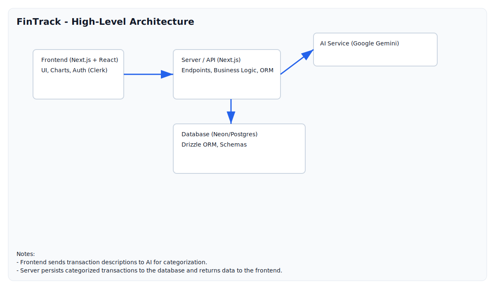

# 💸 FinTrack - AI-Powered Personal Finance Tracker

[](https://nextjs.org/)
[](https://reactjs.org/)
[](https://tailwindcss.com/)
[](https://clerk.dev/)
[](https://neon.tech/)

A modern, AI-powered personal finance tracker that helps you monitor expenses, manage budgets, and make smarter financial decisions. Built with Next.js and enhanced with Google's Gemini AI for intelligent transaction categorization.


## ✨ Features

- 🤖 **AI-Powered Categorization** - Automatic transaction categorization using Google Gemini AI
- 📊 **Interactive Dashboard** - Beautiful charts and visualizations with Recharts
- 💰 **Budget Management** - Set and track monthly budgets with smart alerts
- 💸 **Expense Tracking** - Easy expense and income management
- 🔐 **Secure Authentication** - Powered by Clerk with multiple sign-in options
- 📱 **Responsive Design** - Works seamlessly on desktop, tablet, and mobile
- 🎨 **Modern UI** - Clean interface built with Tailwind CSS and Radix UI
- ⚡ **Real-time Updates** - Live data synchronization with SWR

## � Quick Start

### Prerequisites

- Node.js 18+ and npm/yarn
- A Neon PostgreSQL database
- Clerk account for authentication
- Google AI API key for Gemini integration

### Installation

1. **Clone the repository**
   ```bash
   git clone https://github.com/ShubhamG2004/fintrack.git
   cd fintrack
   ```

2. **Install dependencies**
   ```bash
   npm install
   # or
   yarn install
   ```

3. **Set up environment variables**
   
   Create a `.env.local` file in the root directory:
   ```env
   # Database
   NEXT_PUBLIC_DATABASE_URL=your_neon_database_url
   
   # Clerk Authentication
   NEXT_PUBLIC_CLERK_PUBLISHABLE_KEY=your_clerk_publishable_key
   CLERK_SECRET_KEY=your_clerk_secret_key
   NEXT_PUBLIC_CLERK_SIGN_IN_URL=/sign-in
   NEXT_PUBLIC_CLERK_SIGN_UP_URL=/sign-up
   
   # Google AI
   NEXT_PUBLIC_GEMINI_API_KEY=your_gemini_api_key
   ```

4. **Set up the database**
   ```bash
   npm run db:push
   ```

5. **Run the development server**
   ```bash
   npm run dev
   ```

6. **Open your browser**
   
   Navigate to [http://localhost:3000](http://localhost:3000)

## 🏗️ Project Structure

```
fintrack/
├── app/                          # Next.js App Router
│   ├── (auth)/                   # Authentication routes
│   │   ├── sign-in/
│   │   └── sign-up/
│   ├── (routes)/                 # Protected routes
│   │   └── dashboard/            # Main dashboard
│   │       ├── budgets/          # Budget management
│   │       ├── expenses/         # Expense tracking
│   │       ├── incomes/          # Income management
│   │       └── upgrade/          # Premium features
│   ├── _components/              # Shared components
│   ├── globals.css               # Global styles
│   ├── layout.js                 # Root layout
│   └── page.js                   # Landing page
├── components/                   # Reusable UI components
│   └── ui/                       # Shadcn/ui components
├── lib/                          # Utility libraries
├── utils/                        # Helper functions
│   ├── dbConfig.jsx              # Database configuration
│   ├── schema.jsx                # Database schema
│   ├── getFinancialAdvice.js     # AI integration
│   └── formatNumber.js           # Number formatting
├── public/                       # Static assets
└── package.json                  # Dependencies
```

## 🛠️ Tech Stack

### Frontend

- **Framework**: Next.js 15.2.4 with App Router
- **UI Library**: React 19.0.0
- **Styling**: Tailwind CSS with Tailwind Animate
- **Components**: Radix UI primitives
- **Icons**: Lucide React
- **Charts**: Recharts
- **Animations**: Motion (Framer Motion)

### Backend & Database

- **Database**: PostgreSQL (Neon)
- **ORM**: Drizzle ORM
- **Authentication**: Clerk

### AI & APIs

- **AI Service**: Google Gemini AI
- **Data Fetching**: SWR

### Development Tools

- **Language**: JavaScript with JSConfig
- **Linting**: ESLint
- **Package Manager**: npm
- **Build Tool**: Next.js built-in

---

## 📊 System Workflow

```plaintext
1. User logs in via Clerk/Auth0
2. On dashboard, user adds a new transaction
3. Description sent to AI → categorized automatically
4. Backend saves transaction with AI category
5. Dashboard updates summaries and graphs
6. Budget data is checked for limit violations
7. Alerts generated if overspending occurs
8. User exports data to PDF/Excel → stored/downloaded
```

----
## 🖼️ Architecture Diagrams

### High-Level Design

This diagram shows the overall system architecture: the Next.js frontend, the server/API layer, Google Gemini AI for categorization, and the Neon/Postgres database.



*Notes: Frontend sends transaction text to the server which may call the AI service for automatic categorization. Server persists transactions to the database (Neon) via Drizzle ORM and returns data to the client.*

### Low-Level Design

This diagram drills into the main components and data flow: client pages and components, API routes and controllers, AI integration client, and database tables/migrations.


*Notes: Example sequence — client submits a transaction, server records it as pending, calls Gemini to classify, updates the transaction with the category, persists via Drizzle, and updates SWR cache.*


## Pages


